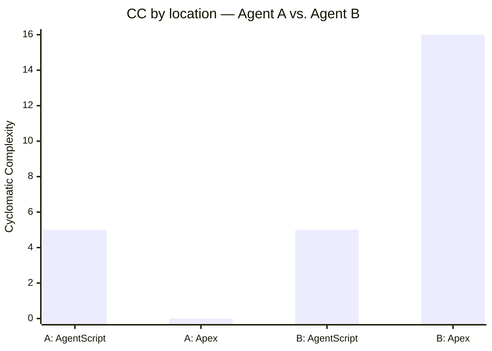

# Example: Voice Agent Posture Comparison

This example runs `sf agentpmd analyze --format markdown` against two real voice
agents that serve the same channel but implement their backing logic differently.
It illustrates how the **CC by location heatmap** surfaces where complexity actually
lives — in the AgentScript reasoning layer, in Apex Invocable classes, or hidden
behind MCP tool boundaries.

---

## Side-by-side heatmap



| | AgentScript | Apex | Combined |
| --- | ---: | ---: | ---: |
| Agent A — MCP-backed | 5 | 0 | **5** |
| Agent B — Mixed Apex/MCP | 5 | 16 | **21** |

The AgentScript layer is identical. The Apex bar for Agent B (16) reflects two
resolved `apex://` classes. Agent A's Apex bar is zero — all domain logic lives
behind `mcpTool://` targets, invisible to this analysis.

---

## Agent A — MCP-backed (all domain logic offloaded to external tools)

One action, one MCP target. All five subagents are CC=1.

```
sf agentpmd analyze --source-dir path/to/VoiceAgent_MCPOnly --format markdown
```

### CC by location

| | AgentScript | Apex | Combined |
| --- | ---: | ---: | ---: |
| **Totals** | 5 | 0 | **5** |

### Per-bundle detail

| Scope | Procedure | CC | Contributors |
| --- | --- | ---: | --- |
| start_agent agent_router | reasoning.instructions | 1 | (base only) |
| subagent escalation | reasoning.instructions | 1 | (base only) |
| subagent off_topic | reasoning.instructions | 1 | (base only) |
| subagent ambiguous_question | reasoning.instructions | 1 | (base only) |
| subagent policy_details | reasoning.instructions | 1 | (base only) |

**Action inventory:** 1 declaration (apex 0, flow 0, prompt 0, unknown 1) · 1 reference

| Action | Kind | Uses |
| --- | --- | ---: |
| `get_policy_details` | mcpTool | 1 |

---

## Agent B — Mixed (Apex Invocable + MCP tools)

Five actions: two Apex Invocable, three MCP. Same 5-scope AgentScript skeleton
as Agent A. Complexity emerges in the Apex layer.

```
sf agentpmd analyze --source-dir path/to/VoiceAgent_Mixed --format markdown
```

### CC by location

| | AgentScript | Apex | Combined |
| --- | ---: | ---: | ---: |
| **Totals** | 5 | 16 | **21** |

### Per-bundle detail

| Scope | Procedure | CC | Contributors |
| --- | --- | ---: | --- |
| start_agent agent_router | reasoning.instructions | 1 | (base only) |
| subagent escalation | reasoning.instructions | 1 | (base only) |
| subagent off_topic | reasoning.instructions | 1 | (base only) |
| subagent ambiguous_question | reasoning.instructions | 1 | (base only) |
| subagent payment_and_policy | reasoning.instructions | 1 | (base only) |

**Action inventory:** 5 declarations (apex 2, flow 0, prompt 0, unknown 3) · 11 references

| Action | Kind | Uses |
| --- | --- | ---: |
| `get_policy_details` | mcpTool | 2 |
| `get_billing_payments` | mcpTool | 2 |
| `list_coverage_riders` | mcpTool | 2 |
| `Get_Payment_Link` | apex | 2 |
| `Email_Payment_Link` | apex | 2 |

### Resolved Apex classes

| Class | Class CC | Hot method | Method CC |
| --- | ---: | --- | ---: |
| `GetDirectLinksAction` | 15 | `extractErrorMessage` | 5 |
| `SendPaymentEmail` | 1 | `sendEmail` | 1 |

**`GetDirectLinksAction` — method breakdown**

| Method | CC | Contributors |
| --- | ---: | --- |
| `getDirectLinks(List<ActionInput>)` | 3 | for=1 if=1 |
| `liveResponse(String)` | 4 | if=1 \|\|=1 catch=1 |
| `extractErrorMessage(String, Integer)` | 5 | if=2 for=1 catch=1 |
| `extractFirstLinkUrl(String)` | 1 | (base only) |
| `stubResponse(String)` | 1 | (base only) |

---

## What the heatmap reveals: the MCP complexity gap

The two agents have identical AgentScript CC (5). The entire observable difference
is in the Apex layer. But Agent B still has three MCP tools whose backing logic is
invisible to `sf agentpmd` — and to any Apex-based static analysis tool.

Projecting equivalent Apex Invocable classes for those three tools (from their
declared action descriptions: policy summary with 4 named warning flags, billing
with conditionally suppressed fields, coverage rider list):

| Class | Projected CC | Hot method driver |
| --- | ---: | --- |
| `GetPolicyDetailsAction` | ~21 | 4 warning-flag branches in parse method |
| `GetBillingPaymentsAction` | ~19 | 3–4 null guards on optional fields |
| `ListCoverageRidersAction` | ~18 | for loop over rider list |

```
                         Observable (current)    Full Apex (projected)
  AgentScript CC:               5                        5
  Apex CC:                     16                       74
  Combined CC:                 21                      ~79
```

The MCP server absorbs **~58 points of complexity** — nearly 3× the entire visible
footprint of Agent B. That complexity does not disappear; it lives in the MCP
server's integration layer, outside the reach of Salesforce org test classes,
`sf code-analyzer`, and PMD.

### When this is acceptable

The MCP architecture is often the right call. The decoupling is real and valuable:
changes to backend logic don't require org deployments or change-control reviews.

The question to answer before accepting the tradeoff is: **does the MCP server
team have their own test harness and CI gate?** If yes, the complexity is tested —
just not from the Salesforce side. If the server is treated as infrastructure
rather than product code, it may be tested by neither side.

`sf-agentpmd` makes this question concrete and answerable by putting a number on
what's crossing the `mcpTool://` boundary.

---

*Generated with [`sf-agentpmd`](https://github.com/bobbywhitesfdc/sf-agentpmd) · `sf agentpmd analyze --format markdown`*
